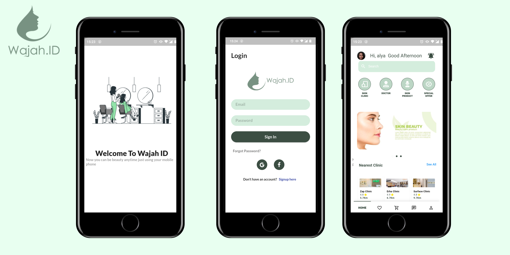

# Wajah.ID

Wajah.ID is a beauty clinic application that can help you to find a beauty specialist to consult, buy skincare products, find our closest clinics in your city

# How to Run Code
Clone or download the repo and place it anywhere in your computer. Open the folder in Android Studio or VS Code. Make sure that you have flutter SDK already installed. Type the command in terminal:

"flutter pub get"

After the command is run successfully you can run the app on real device or on emulator by pressing the Play button in Android Studio or by pressing F5 in VS Code.

# UI Demo
 

All of the apps are listed as below

  This repo gives you amazing flutter ui design! If you like designs please star to support me!
  ### :heart: Star :heart: the repo to support the project or :smile:[Follow Me](https://github.com/Andreas-Earsadn). Thanks!
  
 
 

## MVP (Minimum Viable Products)

MVP 1:
User can find nearest clinic to order a treatment

MVP 2:
User can find a  doctor (skin and beauty specialist) to consult by chat

# Features
## User's Panel
An user can perform the following some features :

1. Find a doctor

2. View clinics that available

3. View skin products that available in clinic

4. Consult with a doctor by chat

5. Edit profile

6. Verification

7. Buy skin products

# Features in Future
Following features could be added in future:

1. Payment Gateway

1. Doctor and Patient can make phone call and video call

2. Doctor's panel

3. Clinic's panel

